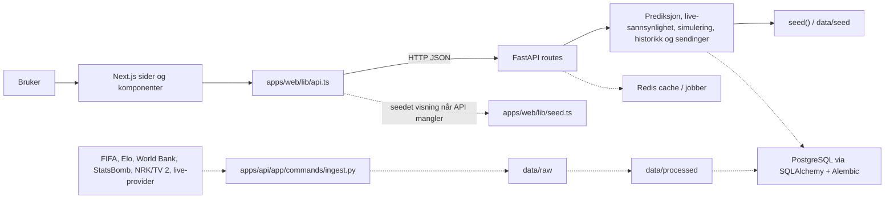

# Systemoversikt

Denne oversikten viser hvordan VM Dashboard og Predikering henger sammen fra bruker til frontend, API, tjenestelag og data.

## Kort forklart

1. Brukeren navigerer i Next.js-appen i `apps/web/app`.
2. `apps/web/lib/api.ts` henter data fra FastAPI når `NEXT_PUBLIC_API_BASE_URL` er satt.
3. Hvis API-URL mangler eller API-et ikke svarer, bruker frontend seed-data fra `apps/web/lib/seed.ts`.
4. FastAPI-rutene i `apps/api/app/api/routes.py` samler data og kaller tjenestene.
5. Tjenestene beregner prediksjoner, live-sannsynlighet, simulering, historikk og kringkastingsvalidering.
6. I dagens versjon leses produktdata fra seed-data, mens PostgreSQL, Redis, raw/processed data og provider-ingest er klargjort for produksjonslignende flyt.

## Hovedflyt

